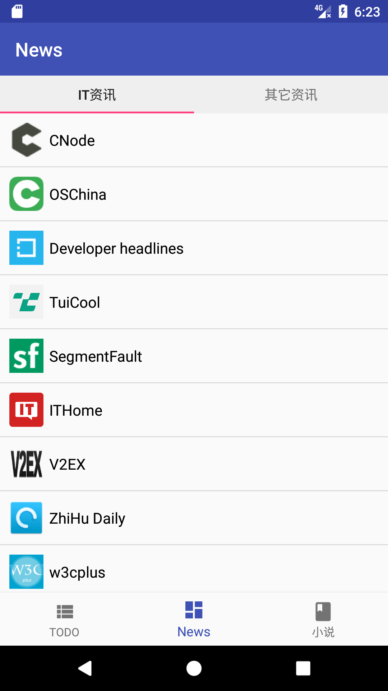

# Android-Apps

## 下载

[Google Play](https://play.google.com/store/apps/details?id=cn.tomoya.apps)

## 打包

build.gradle里没有配置signingConfigs，所以要使用android-studio打包

## 依赖

- recyclerview
- customtabs
- okhttp
- jsoup
- gson
- glide
- circleimageview
- swipebacklayout (功能被我去掉了，想用的话，可以修改一下BaseActivity里的继承)

项目中的列表有些用的是ListView渲染的，有些用的是RecyclerView渲染的

布局用的BottomNavigationView+fragment实现的

## 博客

[https://tomoya92.github.io/category/#Android学习笔记](https://tomoya92.github.io/category/#Android学习笔记)

博客Android部分大都是基于这个项目写的

## 快照

  
  
  

## 开源协议

MIT